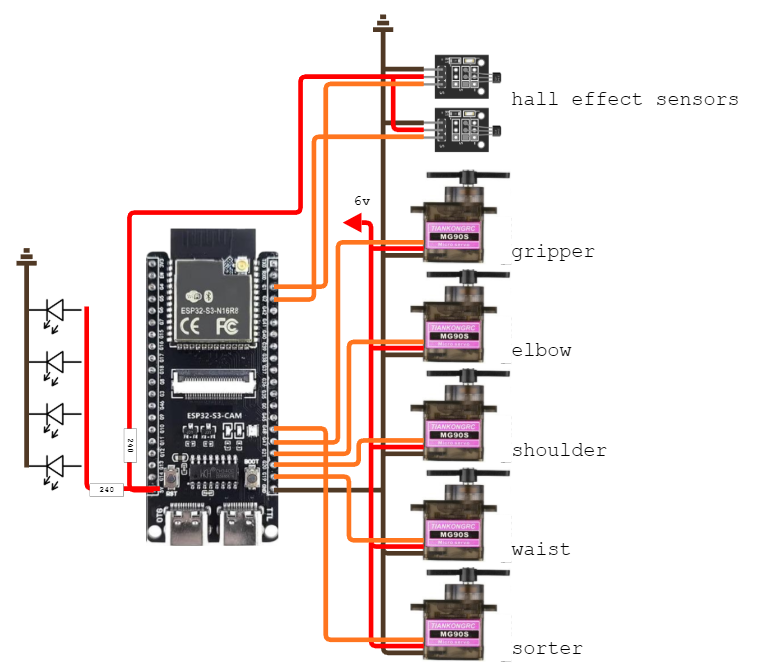

# Automatic-Pick-and-Place-Ferromagnet-Sorter

A modular and not-so-intuitive robot that allows automation of sorting ferromagnetic and non-ferromagnetic materials.

## Robot Schematic

*Note: MG90S servos can be replaced with either SG90 or SG92R (recommended).*

## How Does the Robot Work?

An ESP32S3 with a camera installed is utilized for the robot. Its camera (facing top-down, with the detection area ligned up to the top-left corner of the camera output) will detect the object using the Edge Impulse model, and then it would calculate its position relative to the origin of the camera (top-left corner.) Once that's done, it will then convert the pixel coordinates to real world coordinates in which you can calibrate. Then, the robot will initiate its pick-and-place sequence, which picks up the object and places it down on the magnet detection station. Finally, hall effect sensors will detect if the object is magnetic or not which a servo motor will then push to the respective bin.

## How to Calibrate and Setup the Robot

1. Connect the ESP32S3's USB-Serial to your device with a Type-C cable
2. Open up a Serial Monitor with its speed set to 115200
3. Follow the instructions on the Serial Monitor 

You can use the camera web server (by typing its IP Address to your browser) to measure the length of the pixels, adjusting camera height and angles, etc.

## Object Detection

The robot utilizes an Edge Impulse object detection model, though it can be modified to any Edge Impulse model.

### How to Add your own Edge Impulse Object Detection/Inferencing Model

1. Download your Edge Impulse model as an Arduino Library.
2. Extract the the downloaded zip file in *lib/**
3. Change the **#include**s if needed
3. Enjoy your own Edge Impulse Object Detection/Inferencing Model

## Some Things to Note

This project is in its alpha stage, as further changes and improvements will be frequently done.